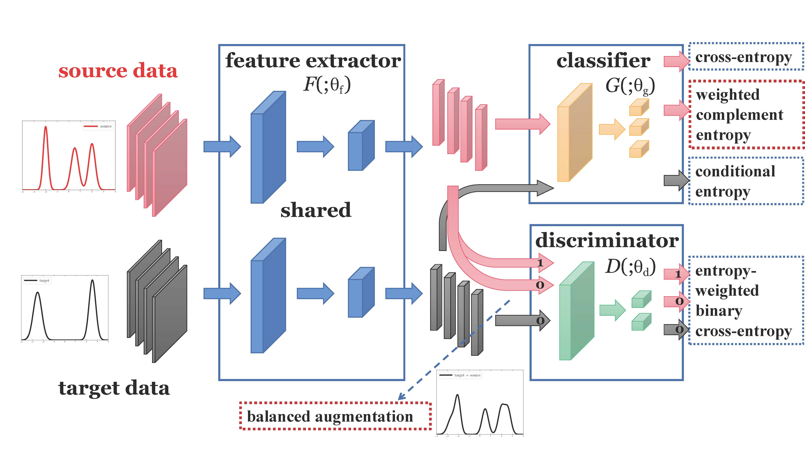

Code for our ECCV (2020) paper [**A Balanced and Uncertainty-aware Approach for Partial Domain Adaptation**](https://arxiv.org/abs/2003.02541). 



### Prerequisites:
- python == 3.6.8
- pytorch ==1.1.0
- torchvision == 0.3.0
- numpy, scipy, PIL, argparse, tqdm

### Dataset:

- Please manually download the datasets [Office](https://drive.google.com/file/d/0B4IapRTv9pJ1WGZVd1VDMmhwdlE/view), [Office-Home](https://drive.google.com/file/d/0B81rNlvomiwed0V1YUxQdC1uOTg/view), [ImageNet-Caltech](http://www.vision.caltech.edu/Image_Datasets/Caltech101/101_ObjectCategories.tar.gz) from the official websites, and modify the path of images in each '.txt' under the folder './data/'.
- We adopt the same data protocol as [PADA](https://github.com/thuml/PADA/tree/master/pytorch/data).

### Training:
1. ##### Partial Domain Adaptation (PDA) on the Office-Home dataset [Art(s=0) -> Clipart(t=1)]
	```python
	python run_partial.py --s 0 --t 1 --dset office_home --net ResNet50 --cot_weight 1. --output run1 --gpu_id 0
	```
	
2. ##### Partial Domain Adaptation (PDA) on the Office dataset [Amazon(s=0) -> DSLR(t=1)]
	 ```python
   python run_partial.py --s 0 --t 1 --dset office --net ResNet50 --cot_weight 5. --output run1 --gpu_id 0
   python run_partial.py --s 0 --t 1 --dset office --net VGG16 --cot_weight 5. --output run1 --gpu_id 0
   ```
   
3. ##### Partial Domain Adaptation (PDA) on the ImageNet-Caltech dataset [ImageNet(s=0) -> Caltech(t=1)]
	 ```python
   python run_partial.py --s 0 --t 1 --dset imagenet_caltech --net ResNet50 --cot_weight 5. --output run1 --gpu_id 0
   ```


### Citation

If you find this code useful for your research, please cite our paper

> @inproceedings{liang2020baus,  
>  &nbsp; &nbsp;  title={A Balanced and Uncertainty-aware Approach for Partial Domain Adaptation},  
>  &nbsp; &nbsp;  author={Liang, Jian, and Wang, Yunbo, and Hu, Dapeng, and He, Ran and Feng, Jiashi},  
>  &nbsp; &nbsp;  booktitle={European Conference on Computer Vision (ECCV)},  
>  &nbsp; &nbsp;  pages={xx-xx},  
>  &nbsp; &nbsp;  month = {August},  
>  &nbsp; &nbsp;  year={2020}  
> }

### Acknowledgement

Some parts of this project are built based on the following open-source implementation 
- CDAN [https://github.com/thuml/CDAN/tree/master/pytorch](https://github.com/thuml/CDAN/tree/master/pytorch)
- COT [https://github.com/henry8527/COT](https://github.com/henry8527/COT)

### Contact
- [liangjian92@gmail.com](mailto:liangjian92@gmail.com)
- [dapeng.hu@u.nus.edu](mailto:dapeng.hu@u.nus.edu)
- [elefjia@nus.edu.sg](mailto:elefjia@nus.edu.sg)
